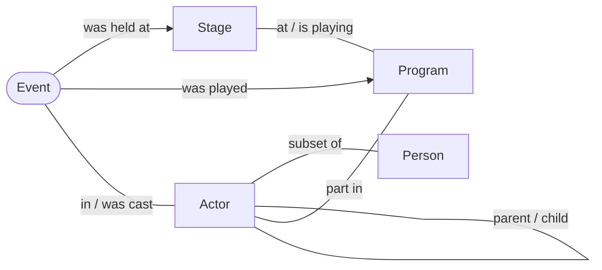

# Anchor Modeling constructs

This document explains the building blocks of an Anchor model, what each one is for, and how it
turns into database objects. It is written for anyone creating or reading models with this tool,
whether a person drawing in the modeler or an agent reading the XML to generate SQL or build a
semantic layer on top of the result.

Examples throughout come from [example.xml](../example.xml), a small model of a theatre business.
See http://www.anchormodeling.com for the theory behind the technique.

## The idea in brief

Anchor Modeling splits a domain into very small pieces, close to the sixth normal form:

- **Things** that have an identity get their own table, holding nothing but that identity.
- **Every property** of a thing gets its own table.
- **Every relationship** between things gets its own table.

Because each piece lives on its own, the model can grow by adding new tables rather than
altering existing ones. Old queries keep working when the model is extended, and history can be
kept for exactly the properties and relationships that need it. Data is only ever added, never
updated in place, so a change is recorded as a new row with a later time rather than an
overwrite.

The price is many narrow tables. The generator compensates by creating views, called
perspectives, that join the pieces back together into one wide row per thing.

## Constructs at a glance

| Construct | XML element | Models | Becomes in the database |
|---|---|---|---|
| [Anchor](#anchor) | `<anchor>` | A thing with an identity, such as an actor or a stage | A table with one identity column |
| [Attribute](#attribute) | `<attribute>` | A property of an anchor or nexus, such as a name | A table of values, keyed by the owner's identity |
| [Knot](#knot) | `<knot>` | A small, shared set of values, such as genders | A lookup table of identities and values |
| [Tie](#tie) | `<tie>` | A relationship between anchors, such as who is cast in what | A table with one column per role |
| [Nexus](#nexus) | `<nexus>` | An event with its own identity and properties, such as a performance | A table holding the identity and its role references |
| [Role](#role) | `<role>` | How an anchor, nexus or knot takes part in a tie or nexus | A column in the tie or nexus table |
| [Key and identifier](#keys-and-identifiers) | `<key>`, `<identifier>` | A natural key, such as a stage being identified by its name | Key views (SQL Server only, so far) |

Most constructs can also carry a `<description>`, a `<metadata>` element with settings, and a
`<layout>` element with the diagram position.

## The example model



Stages (venues) play programs (shows). Actors have parts in programs and are cast in events.
An event is one performance of a program on a stage at a certain time. Knots, such as gender and
rating, are left out of the diagram.

## Anchor

An anchor represents a kind of thing in the domain that has an identity of its own and that you
want to say things about over time: a person, an actor, a stage, a program.

```xml
<anchor mnemonic="AC" descriptor="Actor" identity="int">
    <description>An actor, a person who performs parts in programs and is cast in events.</description>
    <attribute .../>
</anchor>
```

- `mnemonic` is a two-letter code, unique in the model. It prefixes every generated name.
- `descriptor` is the readable name, written in PascalCase.
- `identity` is the data type of the surrogate identity. Pick one large enough for the number of
  instances you expect.
- The generated table holds only the identity (`AC_Actor` with column `AC_ID`). Everything known
  about an actor lives in attribute and tie tables.
- Set `generator` in the metadata if the database should create identities for you from a
  sequence.

**Use an anchor when** the thing has an identity that persists while its properties change, and
other things relate to it. **Do not use an anchor when** the thing is just a value picked from a
short list, such as a status or a category. That is a [knot](#knot).

## Attribute

An attribute is a single property of an anchor or a nexus, such as an actor's name or an event's
audience size. Each attribute gets its own table.

```xml
<attribute mnemonic="NAM" descriptor="Name" timeRange="datetime" dataRange="varchar(42)">
    <description>Name of the actor, such as a stage name.</description>
</attribute>
```

- `mnemonic` is three letters, unique within its anchor or nexus.
- An attribute has either a `dataRange` (a data type, for its own values) or a `knotRange` (the
  mnemonic of a knot whose values it uses), never both.
- A `timeRange` makes it historized: every change is kept, stamped with the time it happened.

This gives four flavors:

| Flavor | Declared with | Example | Use when |
|---|---|---|---|
| Static | `dataRange` | Program name, event audience | The value is not expected to change once recorded |
| Historized | `dataRange` + `timeRange` | Actor name, program length | You need to know what the value was at an earlier point in time |
| Knotted static | `knotRange` | Actor gender | The value comes from a small shared set and does not change |
| Knotted historized | `knotRange` + `timeRange` | Actor professional level | The value comes from a small shared set and changes over time |

For the actor name in the example, the generated table is `AC_NAM_Actor_Name`, with the columns:

- `AC_NAM_AC_ID`, the actor it belongs to
- `AC_NAM_Actor_Name`, the value
- `AC_NAM_ChangedAt`, the time the value became valid

A knotted attribute stores a reference to the knot instead of a value, and the perspectives join
in the knot's value for you.

**Settings in `<metadata>`:**

- `restatable`: whether the same value may be recorded twice in a row over time. Turn it off to
  add a constraint that rejects such restatements.
- `idempotent`: if on, an incoming value that equals the current one is silently skipped. Not
  recommended when data can arrive out of order with respect to changing time.
- `deletable`: allows "deleting" values by updating to null, moving the affected rows to a
  deletion table.
- `equivalent`: allows several equivalent values at once, for example one per language or per
  tenant.
- `checksum`: adds a computed checksum column, for data types too large to index.
- `privacy`: what to do if the data becomes subject to privacy regulation, such as a GDPR request
  to be forgotten. This is informational only.
- `encryptionGroup`: marks the data for encryption at rest, grouped by the name given.

## Knot

A knot is a small, shared set of values that rarely or never changes, such as genders, ratings or
event types. Knots keep repeated strings out of attribute and tie tables and give one place to
maintain the list.

```xml
<knot mnemonic="RAT" descriptor="Rating" identity="tinyint" dataRange="varchar(42)">
    <description>Rating of how well an actor performs a part in a program.</description>
</knot>
```

- `mnemonic` is three letters, unique among knots.
- `identity` is usually a small type such as `tinyint`, since the set is small.
- `dataRange` is the type of the values themselves.
- A knot is used through a `knotRange` on an attribute, or through a role in a tie or nexus.
- `equivalent` and `checksum` work as for attributes.

**Use a knot when** the values form a closed, fairly stable list that many rows refer to.
**Use a plain attribute when** the values are open-ended, such as names, amounts or dates.

## Tie

A tie is a relationship between two or more anchors, possibly including knots. Each participant
takes part through a [role](#role), and a tie must involve at least two anchor roles (the same
anchor may appear twice, as in parent and child).

```xml
<tie timeRange="datetime">
    <role role="part" type="AC" identifier="true"/>
    <role role="in" type="PR" identifier="true"/>
    <role role="got" type="RAT" identifier="false"/>
</tie>
```

The tie's name is built from its roles, so the example above becomes `AC_part_PR_in_RAT_got`,
with the columns `AC_ID_part`, `PR_ID_in` and `RAT_ID_got`.

### Cardinality

The `identifier` flag on each role decides the cardinality. Roles marked as identifiers together
form the primary key of the tie.

| Identifier roles | Cardinality | Example |
|---|---|---|
| All anchor roles | Many-to-many | An actor can be cast in many events, and an event casts many actors (`EV in`, `AC wasCast`) |
| Some anchor roles | Many-to-one, from the identifier side | Each event has one program and one stage (`PR content`, `ST location`, `EV of`, where only the event is an identifier) |
| None | One-to-one | An actor has at most one partner at a time, and the partner has at most one partner too (`AC partner`, `AC with`) |

A knot role marked as an identifier is part of the key, so the same pair of anchors can be
related once per knot value (parent and child, once per parental type). A knot role not marked
as an identifier is a value of the relationship, such as the rating an actor got for a part.

### Flavors

As with attributes, a tie is static or historized (with a `timeRange`), and knotted or not:

- **Static tie:** the relationship holds once established, such as an actor being a person.
- **Historized tie:** the relationship can begin and end, such as which program a stage is
  playing. A new row with a later time replaces the earlier one.
- **Knotted tie:** carries a value from a knot, such as a rating.

A historized tie cannot delete a relationship that has ended, since history is only added to. A
common pattern is to include a knot role that records the state, as the `Ongoing` knot does for
partnerships: the end of a partnership is recorded as a new row saying it is no longer ongoing.

Ties support `restatable`, `idempotent` and `deletable` in their metadata, with the same meaning
as for attributes.

## Nexus

A nexus is an event-like entity: something that happens at a point in time, involves one or more
anchors, and has properties of its own. In the example, an event is one performance of a program
on a stage, with a date, an audience size and a revenue.

```xml
<nexus mnemonic="EV" descriptor="Event" identity="int">
    <attribute mnemonic="DAT" descriptor="Date" dataRange="datetime" chronicle="1"/>
    <attribute mnemonic="AUD" descriptor="Audience" dataRange="int"/>
    <role role="wasHeldAt" type="ST" identifier="false"/>
    <role role="wasPlayed" type="PR" identifier="false"/>
    <role role="of" type="ETY" identifier="false"/>
</nexus>
```

A nexus combines features of an anchor and a tie:

- Like an anchor, it has its own identity (`EV_ID`) and can have attributes.
- Like a tie, it has roles that reference anchors and knots. It must reference at least one
  anchor. Its roles are stored as columns on the nexus table itself, and they are never
  identifiers, because the nexus's own identity already identifies it.
- Ties can reference a nexus, as the casting tie does: `EV in`, `AC wasCast`.
- The nexus itself is immutable once recorded.

**Chronicle.** An attribute with a `chronicle` ordinal of 1 or more places the nexus in time.
Every nexus should have at least one, and the modeler warns if it has none. If several attributes
are marked, the ordinal orders them.

**Use a nexus when** a relationship is really a happening in its own right: it has its own
properties, other things need to refer to it, or the same anchors can be involved in it many
times. **Use a tie when** the relationship is fully described by who takes part, with at most a
knot value and a history of changes.

The example deliberately models the event's program and stage twice, once as nexus roles and once
as the tie `PR content`, `ST location`, `EV of`, to show both styles side by side. In a real model
you would pick one.

## Role

A role says how a participant takes part in a tie or a nexus.

- `role` is the name of the part played, written in camelCase. It must be unique within its tie,
  which is what lets the same anchor take part twice, as with `parent` and `child`.
- `type` is the mnemonic of the anchor, nexus or knot playing the role.
- `identifier` makes the role part of the key. See [cardinality](#cardinality).
- `coloring` is a diagram color only, with no effect on the database.

Choose role names that read as a sentence together with the anchors: "actor **part** (in)
program **in**, **got** rating".

## Keys and identifiers

Surrogate identities (`AC_ID`) are what the model uses internally, but data from source systems
usually arrives with natural keys: a stage is known by its name, an event by its date, stage and
program. Keys describe these natural keys so that incoming data can be matched to existing
identities.

A **key route** is a path through the model that collects the values making up one natural key.
Each step on the path is a `<key>` element placed on an attribute or a role:

- `of` is the anchor or nexus being identified.
- `route` names the key, such as `1st` or `2nd`, so one entity can have several natural keys.
- `stop` is the position of this step along the path.
- `branch` separates parallel paths within the same route.

The event's first route in the example goes through three branches:

| Stop | Branch | Element | Contributes |
|---|---|---|---|
| 1 | 1 | `EV` attribute `Date` | The date of the event |
| 2 | 2 | `EV` role `wasHeldAt` | A path to the stage |
| 3 | 2 | `ST` attribute `Location` | The stage's location |
| 4 | 3 | `EV` role `wasPlayed` | A path to the program |
| 5 | 3 | `PR` attribute `Name` | The program's name |

So an event is identified by its date, the location of its stage and the name of its program.
The stage itself has two routes: the `1st` by location and the `2nd` by name.

An `<identifier route="..."/>` on an anchor or nexus declares that the route is used as an
identifier for it. An identifier is historized if any attribute on its route is historized, since
the key can then change over time.

In the modeler, keys are drawn as routes on the diagram. For code generation, only SQL Server
(uni-temporal) turns routes into key views and tables so far. Other targets keep the keys in the
model without generating objects from them.

## Descriptions

Add a `<description>` to anchors, attributes, knots, ties, nexuses and roles, and one directly
under `<schema>` for the model as a whole. Descriptions are written to the database as comments,
which catalogs, documentation tools and AI agents building semantic models can read.

Good descriptions say what an instance is, not how it is stored: "A single performance of a
program held at a stage", not "Nexus table for events". For attributes, mention the unit or format
when it is not obvious, and for knots, give example values.

## Capsules

A capsule groups parts of a model into a separate database schema, for separation of concerns.
It is set per construct in `<metadata capsule="..."/>` and defaults to the model's encapsulation
setting (`dbo` unless changed).

## Generated objects and naming

With the default naming, names are built from mnemonics and descriptors:

| Object | Pattern | Example |
|---|---|---|
| Anchor table | `{mnemonic}_{descriptor}` | `AC_Actor` |
| Anchor or nexus identity | `{mnemonic}_ID` | `AC_ID` |
| Attribute table and value column | `{anchor}_{attribute}_{anchor descriptor}_{attribute descriptor}` | `AC_NAM_Actor_Name` |
| Attribute changing time | `{anchor}_{attribute}_ChangedAt` | `AC_NAM_ChangedAt` |
| Knot table and value column | `{mnemonic}_{descriptor}` | `GEN_Gender` |
| Tie table | `{type}_{role}` for each role, joined by `_` | `AC_part_PR_in_RAT_got` |
| Tie role column | `{type}_ID_{role}` | `AC_ID_part` |

The generator also creates perspectives, which join an anchor, nexus or tie together with its
attributes and knots into one row:

| Perspective | Prefix | Shows |
|---|---|---|
| Latest | `l` | The most recent value of everything, for example `lAC_Actor` |
| Point-in-time | `p` | Values as they were at a given time (a function taking the time) |
| Now | `n` | Values as of the current time |
| Difference | `d` | Every change between two times |

For querying and for semantic models, the latest perspectives are usually the right starting
point, rather than the individual tables.

## Temporalization

The model's temporalization setting decides what kinds of time the database keeps:

- **uni** (uni-temporal) keeps changing time only: when a value became valid in the domain.
- **crt** (concurrent-reliance-temporal) also keeps when each value was recorded, by whom (the
  positor), and how reliable it is thought to be, so that conflicting or retracted statements can
  coexist.
- **bi** (bitemporal) keeps changing time and the time each value was recorded (positing time),
  using the same posit and annex tables as crt.

The constructs and the model are the same in all three. Only the generated tables and
perspectives differ.
